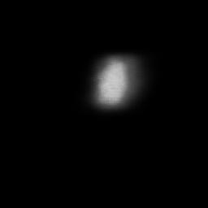
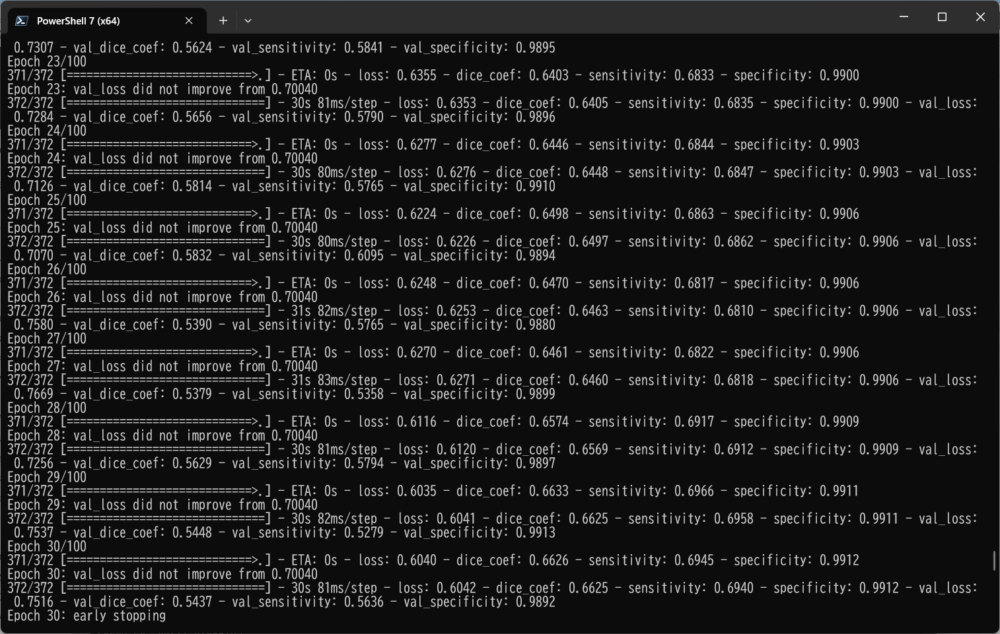

<h2>
Image-Segmentation-Nerve (Updated: 2023/05/28)
</h2>
This is an experimental project to detect <b>Nerve</b> based on <b>Ultrasound Nerve Segmentation</b>
, by using 
<a href="https://github.com/atlan-antillia/Tensorflow-Slightly-Flexible-UNet">
Tensorflow-Slightly-Flexible-UNet.</a> 

 
 The original segmentation dataset for Nerve has been take from the following web site 
<pre>
 https://www.kaggle.com/competitions/ultrasound-nerve-segmentation/data
</pre>

<b>
 Ultrasound Nerve Segmentation 
 Identify nerve structures in ultrasound images of the neck 
</b>

<pre>
Dataset Description
The task in this competition is to segment a collection of nerves called the Brachial Plexus (BP) in ultrasound images. 
You are provided with a large training set of images where the nerve has been manually annotated by humans. 
Annotators were trained by experts and instructed to annotate images where they felt confident about the existence of 
the BP landmark.

Please note these important points:

The dataset contains images where the BP is not present. Your algorithm should predict no pixel values in these cases.
As with all human-labeled data, you should expect to find noise, artifacts, and potential mistakes in the ground truth. 
Any individual mistakes (not affecting the broader integrity of the competition) will be left as is.
Due to the way the acquisition machine generates image frames, you may find identical images or very similar images.
In order to reduce the submission file sizes, this competition uses run-length encoding (RLE) on the pixel values. 
The details of how to use RLE are described on the 'Evaluation' page.
File descriptions
/train/ contains the training set images, named according to subject_imageNum.tif. Every image with the same subject 
number comes from the same person. This folder also includes binary mask images showing the BP segmentations.
/test/ contains the test set images, named according to imageNum.tif. You must predict the BP segmentation for these 
images and are not provided a subject number. There is no overlap between the subjects in the training and test sets.
train_masks.csv gives the training image masks in run-length encoded format. This is provided as a convenience to 
demonstrate how to turn image masks into encoded text values for submission.
sample_submission.csv shows the correct submission file format.

</pre>

<h2>
1. Installing tensorflow on Windows11
</h2>
We use Python 3.8.10 to run tensoflow 2.10.1 on Windows11. 
<h3>1.1 Install Microsoft Visual Studio Community</h3>
Please install <a href="https://visualstudio.microsoft.com/ja/vs/community/">Microsoft Visual Studio Community</a>, 
which can be ITed to compile source code of 
<a href="https://github.com/cocodataset/cocoapi">cocoapi</a> for PythonAPI. 
<h3>1.2 Create a python virtualenv </h3>
Please run the following command to create a python virtualenv of name <b>py38-efficientdet</b>.
<pre>
>cd c:\
>python38\python.exe -m venv py38-efficientdet
>cd c:\py38-efficientdet
>./scripts/activate
</pre>
<h3>1.3 Create a working folder </h3>
Please create a working folder "c:\google" for your repository, and install the python packages. 

<pre>
>mkdir c:\google
>cd    c:\google
>pip install cython
>git clone https://github.com/cocodataset/cocoapi
>cd cocoapi/PythonAPI
</pre>
You have to modify extra_compiler_args in setup.py in the following way:
<pre>
   extra_compile_args=[]
</pre>
<pre>
>python setup.py build_ext install
</pre>

 

 
<h2>
2. Installing Image-Segmentation-Multiple-Myeloma
</h2>
<h3>2.1 Clone repository</h3>
Please clone Image-Segmentation-Nerve.git in the working folder <b>c:\google</b>. 
<pre>
>git clone https://github.com/atlan-antillia/Image-Segmentation-Nerve.git 
</pre>
You can see the following folder structure in Image-Segmentation-Nerve of the working folder. 

<pre>
Image-Segmentation-Multiple-Myeloma
├─eval
├─mini_test
├─mini_test_output
├─models
└─Nerve
    ├─train
    │  ├─images
    │  └─masks
    └─test
        ├─images
        └─masks
</pre>
<h3>2.2 Install python packages</h3>

Please run the following command to install python packages for this project. 
<pre>
>cd ./Image-Segmentation-Multiple-Myeloma
>pip install -r requirements.txt
</pre>

 
<h3>2.3 Create Nerve dataset</h3>
<h3>
2.3.1. Download 
</h3>
Please download original <b>Multiple Myeloma Plasma Cells</b> dataset from the following link.
 
<b>
 Ultrasound Nerve Segmentation 
 Identify nerve structures in ultrasound images of the neck 
</b>
<pre>
 https://www.kaggle.com/competitions/ultrasound-nerve-segmentation/data
</pre>
The folder structure of the dataset is the following. 
<pre>
ultrasound-nerve-segmentation
├─test
└─train
</pre>
The <b>train</b> folder of this dataset contains the ordinary image files and mask files. 
We dont' touch image files in <b>test</b> folder, because it has only ordinary image files, no
mask files. 
<b>ultrasound-nerve-segmentation_train_samples:</b> 

 
<h3>
2.3.2. Generate Nerve Image Dataset
</h3>
 We have created Python script <a href="./create_nerve_master.py">create_nerve_master.py</a> to create images and masks dataset which may be used to train our
 TensorflowUNet model. 
 This script will perform following image processing. 
 <pre>
 1 Resize all tif files in <b>ultrasound-nerve-segmentation/train</b> folder to 256x256 square image.
 2 Split image and mask files in <b>ultrasound-nerve-segmentation/train</b> folder into train and test
  for our model. 
</pre>

<!--

<h3>
2.3.4. NerveDataset
</h3>
In <a href="./NerveDataset.py">NerveDataset</a>class, we have tried to create the blurred mask images in the files in <b>masks</b> folder of train and test. 
By this modification, the boundary of a mask image region will get blurred. 
<table>
<tr><td>Original mask image</td><td>Blurred mask image</td></tr>

<tr><td> </td><td></td></tr>
</table>

 
 -->

<h3>
2.3.3 Generated Nerve dataset. 
</h3>
Finally, we have generated the resized (256x256) jpg files dataset below.  
<pre>
Nerve
├─train
│  ├─images
│  └─masks
└─valid
    ├─images
    └─masks
</pre>

<h2>
3 Train TensorflowUNet Model
</h2>
 We have trained Nerve TensorflowUNet Model by using the following
 <b>train_eval_infer.config</b> file.  
Please run the following bat file. 
<pre>
>1.train.bat
</pre>
, which simply runs the following command. 
<pre>
>python TensorflowUNetNerveTrainer.py
</pre>
This python script above will read the following configration file, build TensorflowUNetModel, and
start training the model by using 
<pre>
; train_eval_infer.config
; 2023/5/28 antillia.com
; Modified to use loss and metric
; Specify loss as a function nams
; loss =  "binary_crossentropy"
; Specify metrics as a list of function name
; metrics = ["binary_accuracy"]
; Please see: https://www.tensorflow.org/api_docs/python/tf/keras/Model?version=stable#compile
; 
; Added dilation parameter in [model] section.

[model]
image_width    = 256
image_height   = 256
image_channels = 3
num_classes    = 1
base_filters   = 16
num_layers     = 6
dropout_rate   = 0.08
learning_rate  = 0.001
dilation       = (2, 2)
loss           = "binary_crossentropy"
metrics        = ["binary_accuracy"]
show_summary   = False

[train]
epochs        = 100
batch_size    = 4
patience      = 10
metrics       = ["binary_accuracy", "val_binary_accuracy"]

model_dir     = "./models"
eval_dir      = "./eval"

image_datapath = "./Nerve/train/images/"
mask_datapath  = "./Nerve/train/masks/"

[eval]
image_datapath = "./Nerve/test/images/"
mask_datapath  = "./Nerve/test/masks/"

[infer] 
images_dir    = "./mini_test" 
output_dir    = "./mini_test_output"
merged_dir    = "./mini_test_output_merged"

</pre>

Since <pre>loss = "binary_crossentropy"</pre> and <pre>metrics = ["binary_accuracy"] </pre> are specified 
in <b>train_eval_infer.config</b> file,
<b>binary_crossentropy</b> and <b>binary_accuracy</b> functions are used to compile our model as shown below.
<pre>
    # Read a loss function name from a config file, and eval it.
    # loss = "binary_crossentropy"
    self.loss  = eval(self.config.get(MODEL, "loss"))

    # Read a list of metrics function names from a config file, and eval each of the list,
    # metrics = ["binary_accuracy"]
    metrics  = self.config.get(MODEL, "metrics")
    self.metrics = []
    for metric in metrics:
      self.metrics.append(eval(metric))
        
    self.model.compile(optimizer = self.optimizer, loss= self.loss, metrics = self.metrics)
</pre>
You can also specify other loss and metrics functions in the config file. 
Example: basnet_hybrid_loss(https://arxiv.org/pdf/2101.04704.pdf) 
<pre>
loss         = "basnet_hybrid_loss"
metrics      = ["dice_coef", "sensitivity", "specificity"]
</pre>
On detail of these functions, please refer to <a href="./losses.py">losses.py</a> , and 
<a href="https://github.com/shruti-jadon/Semantic-Segmentation-Loss-Functions/tree/master">Semantic-Segmentation-Loss-Functions (SemSegLoss)</a>.

We have also used Python <a href="./NerveDataset.py">NerveDataset.py</a> script to create
train and test dataset from the images and masks specified by
<b>image_datapath</b> and <b>mask_datapath </b> parameters in the configratration file. 
The training process has just been stopped at epoch 20 by an early-stopping callback as shown below.  
 
 
The <b>val_accuracy</b> is very high as shown below from the beginning of the training. 
<b>Train accuracies line graph</b>: 
 

 
The val_loss is also very low as shown below from the beginning of the training. 
<b>Train losses line graph</b>: 
 

<h2>
4 Evaluation
</h2>
 We have evaluated prediction accuracy of our Pretrained Nerve Model by using <b>test</b> dataset.
Please run the following bat file. 
<pre>
>2.evalute.bat
</pre>
, which simply run the following command. 
<pre>
>python TensorflowUNetNerveEvaluator.py
</pre>
The evaluation result of this time is the following. 
 
 

<h2>
5 Inference 
</h2>
We have also tried to infer the segmented region for <b>mini_test</b> dataset, which is a very small dataset including only ten images extracted from <b>test</b> dataset,
 by using our Pretrained Nerve Model. 
<pre>
>3.infer.bat
</pre>
, which simply runs the following command. 
<pre>
>python TensorflowUNetNerveInfer.py
</pre>

<b>Input images (mini_test) </b> 
 
 
<b>Infered images (mini_test_output)</b> 
Some green tumor regions in the original images of the mini_test dataset above have been detected as shown below.
  

 
<b>Detailed images comarison:</b> 
<table>
<tr><td>mini_test/9_21.jpg</td></tr>
<tr>
<td></td>
<td></td>
</tr>
<tr><td>mini_test/11_20.jpg</td></tr>

<tr>
<td></td>
<td></td>
</tr>

<tr><td>mini_test/13_31.jpg</td></tr>

<tr>
<td></td>
<td></td>
</tr>

<tr><td>mini_test/26_2.jpg</td></tr>

<tr>
<td></td>
<td></td>
</tr>

<tr><td>mini_test/33_24.jpg</td></tr>

<tr>
<td></td>
<td></td>
</tr>

</table>
<!--
-->

<b>Merged Inferred images (mini_test_output_meraged)</b> 
  
 
<h2>
6 Train TensorflowUNet Model with basnet_hybrid_loss
</h2>
 We have also trained Nerve TensorflowUNet Model by using the following
 <b>train_eval_infer_basnet_hybrid_loss.config</b> file.  
Please run the following bat file. 
<pre>
>4.train.bat
</pre>
, which simply runs the following command. 
<pre>
>python ./TensorflowUNetNerveTrainer.py train_eval_infer_basnet_hybrid_loss.config
</pre>
This python script above will read the following configration file, build TensorflowUNetModel, and
start training the model by using 
<pre>
; train_eval_infer_basnet_hybrid_loss.config
; 2023/5/28 antillia.com
; Modified to use loss
; Specify
; loss         = "basnet_hybrid_loss"

[model]
image_width    = 256
image_height   = 256

image_channels = 3
num_classes    = 1
base_filters   = 16
num_layers     = 6
dropout_rate   = 0.08
learning_rate  = 0.001
dilation       = (2, 2)
loss         = "basnet_hybrid_loss"
metrics      = ["dice_coef", "sensitivity", "specificity"]
show_summary   = False

[train]
epochs        = 100
batch_size    = 4
patience      = 10
metrics       = ["dice_coef", "val_dice_coef"]
model_dir     = "./basnet_models"
eval_dir      = "./basnet_eval"

image_datapath = "./Nerve/train/images/"
mask_datapath  = "./Nerve/train/masks/"

[eval]
image_datapath = "./Nerve/test/images/"
mask_datapath  = "./Nerve/test/masks/"

[infer] 
images_dir    = "./mini_test" 
output_dir    = "./basnet_mini_test_output"
merged_dir    = "./basnet_mini_test_output_merged"
</pre>
<b>image_datapath</b> and <b>mask_datapath </b> parameters in the configratration file. 
The training process has just been stopped at epoch 30 by an early-stopping callback as shown below.  
 
 
The <b>val_accuracy</b> is very high as shown below from the beginning of the training. 
<b>Train accuracies line graph</b>: 
 

 
The val_loss is also very low as shown below from the beginning of the training. 
<b>Train losses line graph</b>: 
 

 

<h2>
7 Evaluation with basnet_hybrid_loss
</h2>
 We have evaluated prediction accuracy of our Pretrained Nerve Model by using <b>test</b> dataset.
Please run the following bat file. 
<pre>
>5.evalute.bat
</pre>
, which simply run the following command. 
<pre>
>python TensorflowUNetNerveEvaluator.py train_eval_infer_basnet_hybrid_loss.config
</pre>
The evaluation result of this time is the following. 
 
 

<h2>
8 Inference with basnet_hybrid_loss
</h2>
We have also tried to infer the segmented region for <b>mini_test</b> dataset, which is a very small dataset including only ten images extracted from <b>test</b> dataset,
 by using our Pretrained Nerve Model. 
<pre>
>6.infer.bat
</pre>
, which simply runs the following command. 
<pre>
>python TensorflowUNetNerveInfer.py train_eval_infer_basnet_hybrid_loss.config
</pre>

<b>Input images (mini_test) </b> 
 
 
<b>Infered images (basnet_mini_test_output)</b> 
Some green tumor regions in the original images of the mini_test dataset above have been detected as shown below.
  

<b>Merged Inferred images (basnet_mini_test_output_meraged)</b> 
  
 
